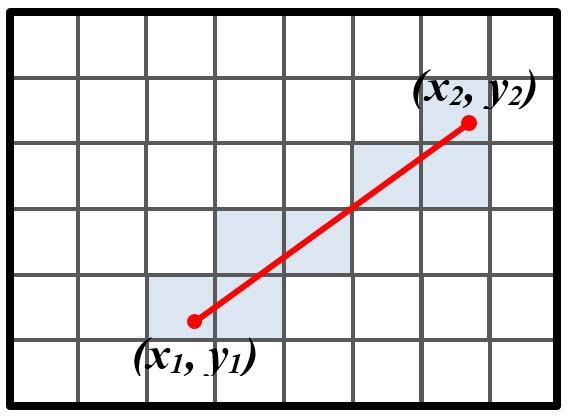

## **Rappel des bases**
on est sur une carte 2d et le principe est de faire un monde 3d (ou du moins une representation 3d)
Pour ca nous avons plusieur chose a voir et prendre en compte a partir de la map

# **La map**
1. la map 2d nous sert de reference pour la creation de notre rendu 3d.
2. elle nous sert a pouvoir difinire les textures {murs, sol, plafond, etc..}
3. nous utilison un ratio pour -1,1 pour convertir la map 2d qui elle est un tableau en 2 dimention char ** (dans notres cas) dans une fenetre de jeu qui elle est definie en pixel Exemple 800px large part 600px de haut.je monterais le calcule plus bas. Mais en gros c'est pour en quelque sorte metre a l'echelle nos calcules de la map en 2d a la map en 3d

# **Pourquoi utiliser l'algorithme DDA
c'est pour econnomiser du calcule tout d'abore car de bases le raycasting etait fait avec une sort d'algorithme de  **Bresenham** qui lui fonctionne pas de la meme facon meme si le resulta est plus ou moin le meme.
**je m'explique**
avec **Bresenham** l'idee est de tracer une droite, dans notre cas un rayon qui part du joueur et arrive jusqu'a un mur (pour l'exemple) ce qui va ce passer c'est que imaginon que nous avons une mape 2d de 20 cellule de large et de 10 de haut et que chaque tuile fasse 10px de large et 10px de haut
si nous devont tracet une ligne comme dans limage ci-dessous

 <!-- bad img -->

comme on peut le voir on trace une de point sucecsif, ce qui fait beaucoup de calcule, pour remedier a ca on va utiliser **l'algorithme DDA**

cette fois ci a la place de calculer chaque point d'un point A a un point B
On va utilise une approche incrémentale pour déterminer les points le long d'une ligne droite entre deux points donnés
comme l'image ci-dessous

<!-- Bad img just for time-->

 <!--video Super Fast Ray Casting in Tiled Worlds using DDA -->

## **Fonctionnement**

 

[lien util pour comprendre la dda et sont fonctionnement  ](https://www.geeksforgeeks.org/dda-line-generation-algorithm-computer-graphics/)